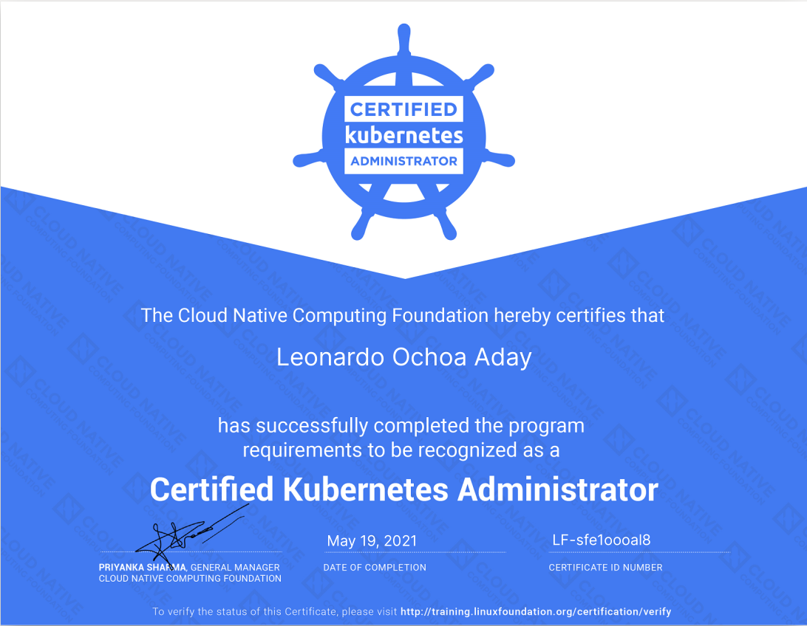

# Certified Kubernetes Administrator (CKA) exam

Online version of the objectives for the CKA exam can be found in this [link](https://github.com/cncf/curriculum/blob/master/old-versions/CKA_Curriculum_v1.20.pdf).

## CKA Curriculum

Outline of the Knowledge, Skills and Abilities that a Certified Kubernetes Administrator (CKA) can be expected to demonstrate.

### Cluster Architecture, Installation & Configuration

- Manage role based access control (RBAC)
- Use Kubeadm to install a basic cluster
- Manage a highly-available Kubernetes cluster
- Provision underlying infrastructure to deploy a Kubernetes cluster
- Perform a version upgrade on a Kubernetes cluster using Kubeadm
- Implement etcd backup and restore

### Workloads & Scheduling

- Understand deployments and how to perform rolling update and rollbacks
- Use ConfigMaps and Secrets to configure applications
- Know how to scale applications
- Understand the primitives used to create robust, self-healing, application deployments
- Understand how resource limits can affect Pod scheduling
- Awareness of manifest management and common templating tools

### Services & Networking

- Understand host networking configuration on the cluster nodes
- Understand connectivity between Pods
- Understand ClusterIP, NodePort, LoadBalancer service types and endpoints
- Know how to use Ingress controllers and Ingress resources
- Know how to configure and use CoreDNS
- Choose an appropriate container network interface plugin

### Storage

- Understand storage classes, persistent volumes
- Understand volume mode, access modes and reclaim policies for volumes
- Understand persistent volume claims primitive
- Know how to configure applications with persistent storage

### Troubleshooting

- Evaluate cluster and node logging
- Understand how to monitor applications
- Manage container stdout & stderr logs
- Troubleshoot application failure
- Troubleshoot cluster component failure
- Troubleshoot networking

> All the configurations must persist after reboot without intervention.

## Certificate

A direct link to the Credly webpage can be found [here](https://www.credly.com/badges/eb6dc9eb-bd6d-4f04-b1e2-a5529dc2fa3f).

- **Date:** May 19, 2021
- **Platform:** Kubernetes v1.20
