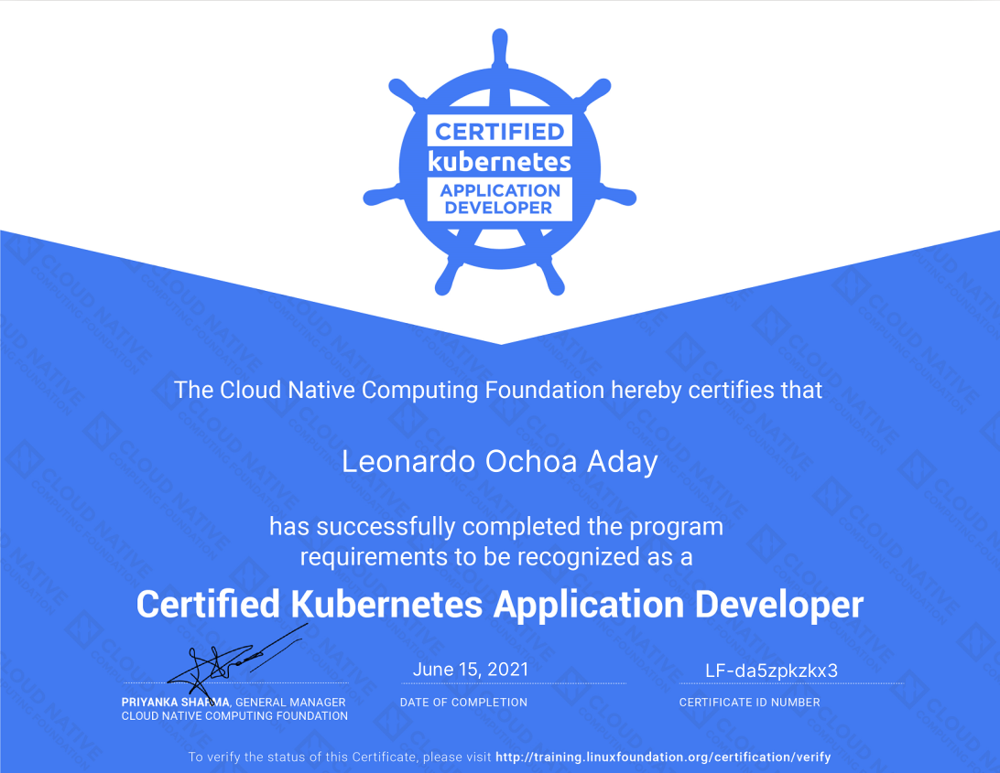

# Certified Kubernetes Application Developer (CKAD) exam

Online version of the objectives for the CKAD exam can be found in this [link](https://github.com/cncf/curriculum/blob/master/old-versions/CKAD_Curriculum_V1.21.pdf).

## CKAD Curriculum

Outline of the Knowledge, Skills and Abilities that a Certified Kubernetes Application Developer (CKAD) can be expected to demonstrate.

### Core Concepts

- Understand Kubernetes API primitives
- Create and configure basic Pods

### Configuration

- Understand ConfigMaps
- Understand SecurityContexts
- Define an application’s resource requirements
- Create & consume Secrets
- Understand ServiceAccounts

### Multi-Container Pods

- Understand Multi-Container Pod design patterns (e .g. ambassador, adapter, sidecar)

### Observability

- Understand `LivenessProbes` and `ReadinessProbes`
- Understand container logging
- Understand how to monitor applications in Kubernetes
- Understand debugging in Kubernetes

### Pod Design

- Understand Deployments and how to perform rolling updates
- Understand Deployments and how to perform rollbacks
- Understand Jobs and CronJobs
- Understand how to use Labels, Selectors, and Annotations

### Services & Networking

- Understand Services
- Demonstrate basic understanding of NetworkPolicies

### State Persistence

- Understand PersistentVolumeClaims for storage

## Certificate

A direct link to the Credly webpage can be found [here](https://www.credly.com/badges/e50cffbb-9ab3-4630-8641-cca8d64fee21).

- **Date:** Jun 15, 2021
- **Platform:** Kubernetes v1.21
