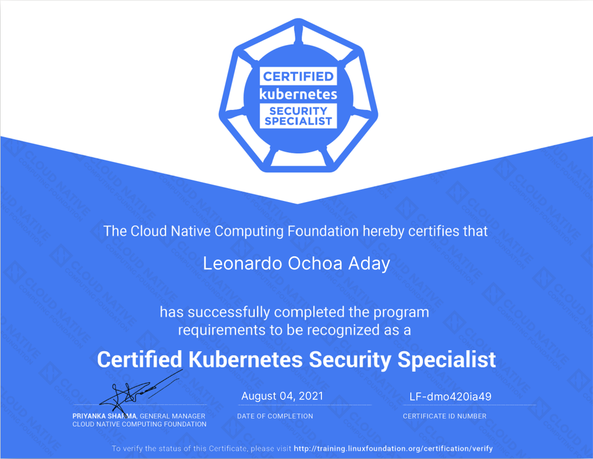

# Certified Kubernetes Security Specialist (CKS) exam

Online version of the objectives for the CKS exam can be found in this [link](https://github.com/cncf/curriculum/blob/master/old-versions/CKS_Curriculum_%20v1.21.pdf).

## CKS Curriculum

Outline of the Knowledge, Skills and Abilities that a Certified Kubernetes Security Specialist (CKS) can be expected to demonstrate.

### Cluster Setup

- Use Network security policies to restrict cluster level access
- Use CIS benchmark to review the security configuration of Kubernetes components (`etcd`, `kubelet`, `kubedns`, `kubeapi`)
- Properly set up Ingress objects with security control
- Protect node metadata and endpoints
- Minimize use of, and access to, GUI elements
- Verify platform binaries before deploying

### Cluster Hardening

- Restrict access to Kubernetes API
- Use Role Based Access Controls to minimize exposure
- Exercise caution in using service accounts e.g. disable defaults, minimize permissions on newly created ones
- Update Kubernetes frequently

### System Hardening

- Minimize host OS footprint (reduce attack surface)
- Minimize IAM roles
- Minimize external access to the network
- Appropriately use kernel hardening tools such as AppArmor, seccomp

### Minimize Microservice Vulnerabilities

- Setup appropriate OS level security domains e.g. using PSP, OPA, security contexts
- Manage kubernetes secrets
- Use container runtime sandboxes in multi-tenant environments (e.g. `gvisor`, `kata` containers)
- Implement pod to pod encryption by use of mTLS

### Supply Chain Security

- Minimize base image footprint
- Secure your supply chain: whitelist allowed image registries, sign and validate images
- Use static analysis of user workloads (e.g. kubernetes resources, docker files)
- Scan images for known vulnerabilities

### Monitoring, Logging and Runtime Security

- Perform behavioral analytics of syscall process and file activities at the host and container level to detect malicious activities
- Detect threats within physical infrastructure, apps, networks, data, users and workloads
- Detect all phases of attack regardless where it occurs and how it spreads
- Perform deep analytical investigation and identification of bad actors within environment
- Ensure immutability of containers at runtime
- Use Audit Logs to monitor access

## Certificate

A direct link to the Credly webpage can be found [here](https://www.credly.com/badges/5589fab9-158a-47b3-8faf-b450b8885543).

- **Date:** Aug 04, 2021
- **Platform:** Kubernetes v1.21
